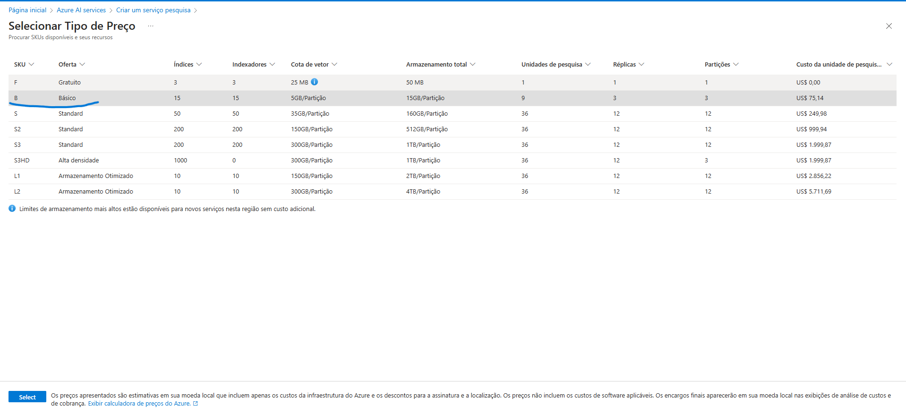
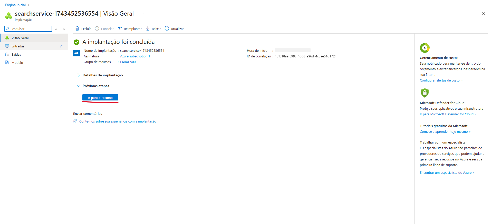
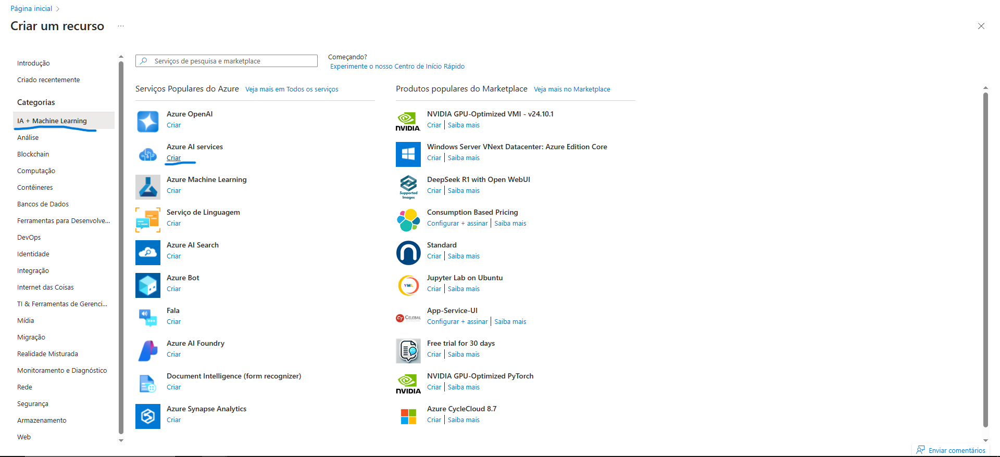
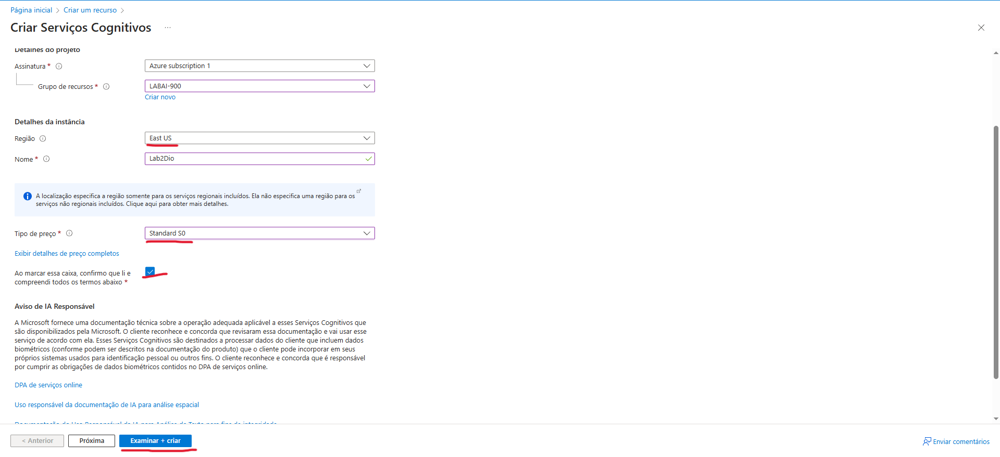
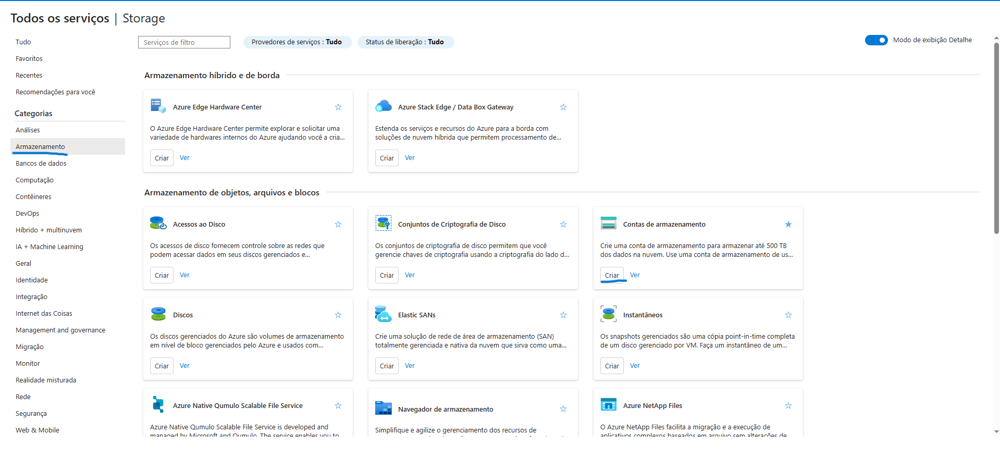
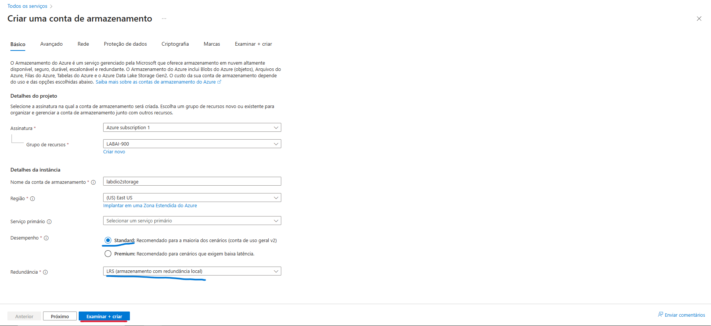
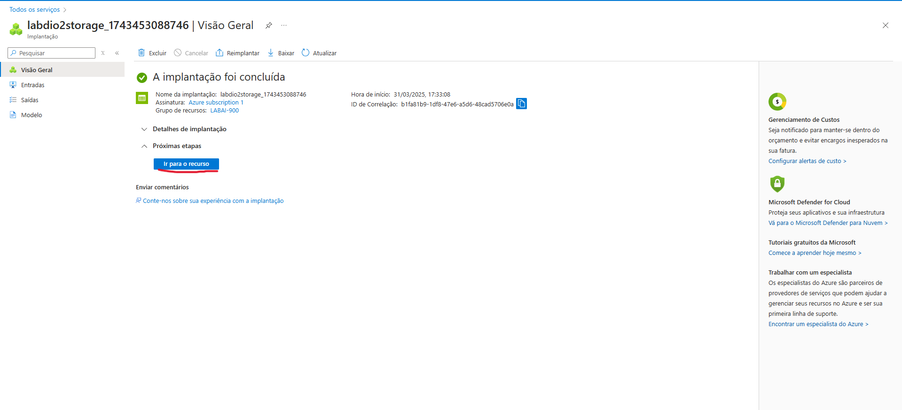
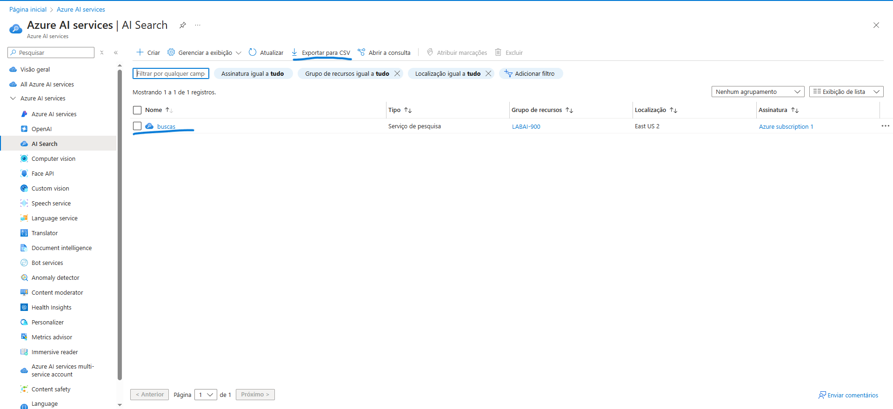
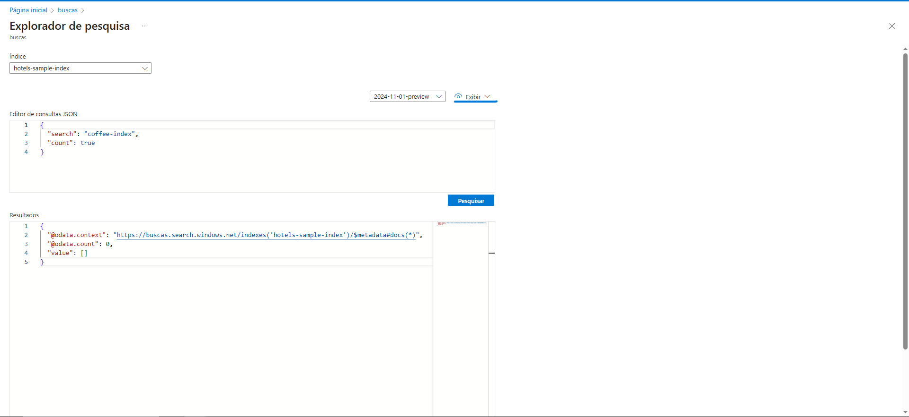

# Explorando um Índice de Pesquisa do Azure AI

## Visão Geral
Neste guia, você aprenderá a configurar um **índice de pesquisa do Azure AI** para extrair insights de avaliações de clientes. A solução usará **Azure AI Search**, **Serviços de IA do Azure** e **Armazenamento do Azure**.

## 1️⃣ Criando um Recurso de Pesquisa do Azure AI
1. Acesse o [Portal do Azure](https://portal.azure.com/).
2. Clique em **+ Criar um recurso** e pesquise por **Azure AI Search**.
3. Configure com os seguintes parâmetros:
    - **Grupo de recursos:** Selecione ou crie um novo.
    - **Nome do serviço:** Escolha um nome único.
    - **Localização:** Escolha uma região disponível.
    - **Nível de preço:** Básico.
4. Clique em **Revisar + Criar** e depois em **Criar**.
5. Após a implantação, clique em **Ir para o recurso**.  

---

## 2️⃣ Criando um Recurso de Serviços de IA do Azure
1. No portal do Azure, clique em **+ Criar um recurso** e pesquise por **Azure AI services**.
2. Selecione **Criar um plano de serviços do Azure AI**.
3. Configure com:
    - **Grupo de recursos:** O mesmo usado no **Azure AI Search**.
    - **Região:** O mesmo local do serviço de pesquisa.
    - **Nível de preço:** Standard S0.
4. Clique em **Revisar + Criar** e depois em **Criar**.

---

## 3️⃣ Criando uma Conta de Armazenamento
1. No portal do Azure, clique em **+ Criar um recurso** e pesquise por **Conta de Armazenamento**.
2. Configure com:
    - **Grupo de recursos:** O mesmo dos serviços anteriores.
    - **Nome da conta de armazenamento:** Escolha um nome único.
    - **Desempenho:** Padrão.
    - **Redundância:** Armazenamento redundante local (LRS).
3. Clique em **Revisar + Criar** e depois em **Criar**.
4. No menu à esquerda, vá para **Configuração** e ative **Permitir acesso anônimo do Blob**.

---

## 4️⃣ Carregando Documentos para o Armazenamento
1. No portal do Azure, vá até a **Conta de Armazenamento** criada.
2. No menu à esquerda, clique em **Contêineres** e selecione **+ Container**.
3. Configure:
    - **Nome:** `coffeereviews`.
    - **Nível de acesso público:** Container (acesso de leitura anônimo).
4. Clique em **Criar**.
5. Baixe [os arquivos de avaliações de café](https://aka.ms/mslearn-coffee-reviews) e extraia para uma pasta.
6. No contêiner **coffee-reviews**, clique em **Upload** e selecione os arquivos extraídos.

---

## 5️⃣ Criando um Índice no Azure AI Search
1. No portal do Azure, acesse o **Azure AI Search**.
2. Vá até **Visão Geral** e clique em **Importar dados**.
3. Clique em **Avançar: Adicionar habilidades cognitivas**.

---

## 6️⃣ Enriquecendo os Dados com IA
1. Na seção **Anexar serviços de IA**, selecione seu recurso de **Serviços de IA do Azure**.
2. Em **Adicionar enriquecimentos**

---

## 8️⃣ Consultando o Índice
1. No **Azure AI Search**, acesse o **Search Explorer**.
2. Selecione o índice `coffee-index` e altere a exibição para **JSON View**.
3. No campo de consulta, insira a seguinte pesquisa para visualizar os dados indexados:

