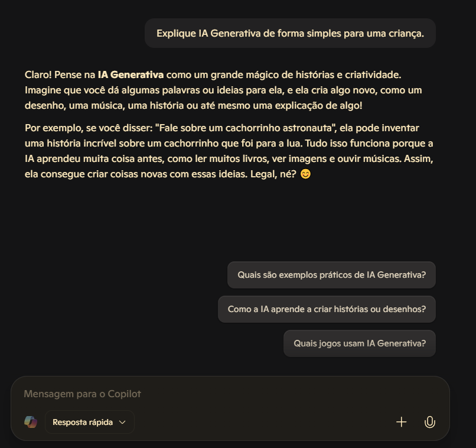
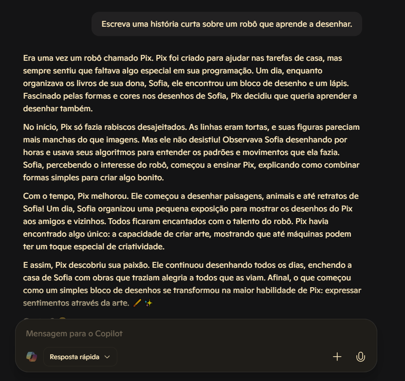
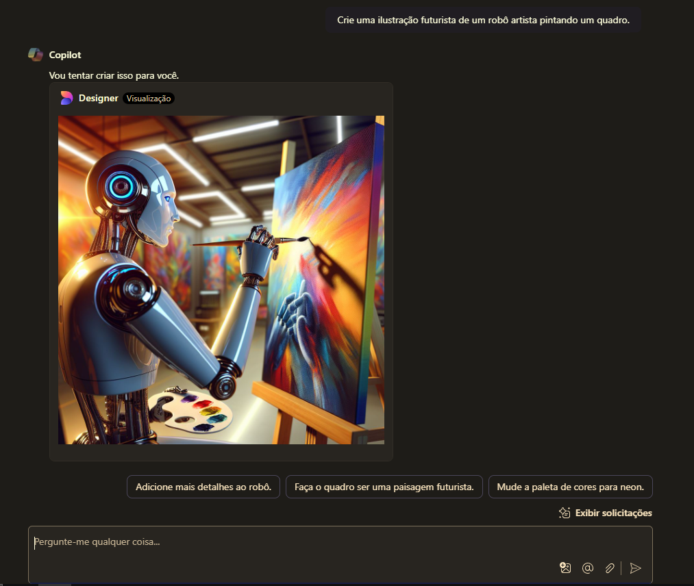
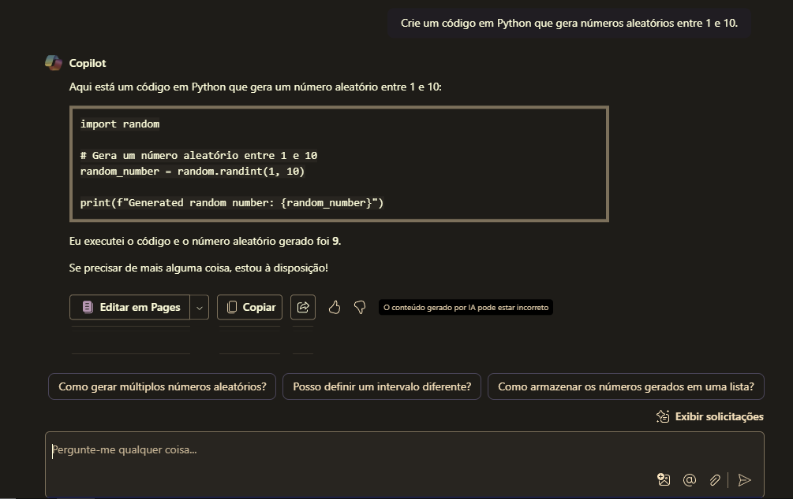
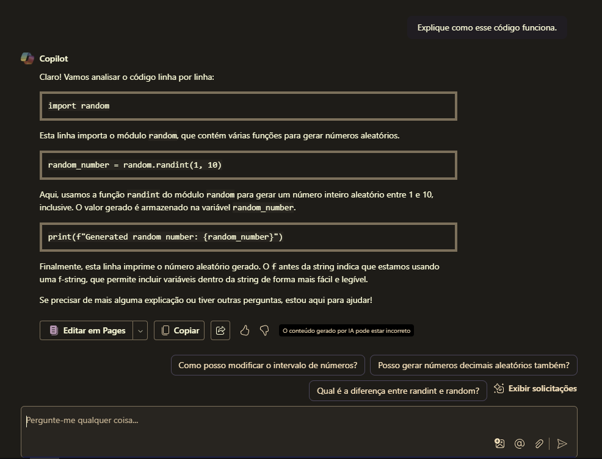

# Explorando os Recursos de IA Generativa com Copilot e OpenAI 🚀

A IA Generativa está transformando a maneira como interagimos com a tecnologia. Seja criando textos, imagens ou até código, essas ferramentas podem facilitar o dia a dia e impulsionar a criatividade.

Neste documento, você verá um **passo a passo prático** explorando o **Microsoft Copilot** e o **Azure OpenAI**, além de insights sobre suas aplicações e limitações.

---

## 🔹 1. IA Generativa com o Microsoft Copilot

### 📌 O que é IA Generativa?
A IA Generativa é um tipo de inteligência artificial capaz de **criar novos conteúdos** de maneira autônoma, como textos, imagens, músicas e códigos.

Diferente da IA tradicional, que **apenas analisa ou classifica dados**, a IA Generativa **gera algo novo**, como um escritor digital ou um artista virtual.

### 🛠️ Testando o Microsoft Copilot
O **Copilot** é um assistente de IA que pode responder perguntas, gerar imagens e até escrever códigos. Vamos ver como ele se sai em algumas tarefas!

#### ✍️ 1.1 Criando Textos com IA
Experimentei alguns prompts no [Copilot](https://copilot.microsoft.com/), e aqui estão os resultados:

✅ **Pergunta 1:** `"Explique IA Generativa de forma simples para uma criança."`  

✅ **Pergunta 2:** `"Escreva uma história curta sobre um robô que aprende a desenhar."`  

🔹 **Insight:** O Copilot cria respostas coerentes e até criativas, mas pode ser necessário ajustar os prompts para obter respostas mais personalizadas.

---

#### 🎨 1.2 Criando Imagens com IA

✅ **Prompt usado:** `"Crie uma ilustração futurista de um robô artista pintando um quadro."`  

🔹 **Insight:** A IA consegue criar imagens bem interessantes, mas às vezes pode interpretar detalhes de maneira diferente do esperado.

---

#### 💻 1.3 Gerando Código com IA
O Copilot também pode escrever códigos automaticamente!

✅ **Pergunta:** `"Crie um código em Python que gera números aleatórios entre 1 e 10."`  

✅ **Pergunta:** `"Explique como esse código funciona."`  

🔹 **Insight:** A IA pode ser uma ótima ferramenta para quem está aprendendo a programar, mas é sempre bom revisar o código gerado.

---

## 🔹 Conclusão

A IA Generativa é uma ferramenta poderosa e em constante evolução! 🚀

🔹 **Aprendizados principais:**  
✅ A IA pode criar textos, imagens e códigos rapidamente.  
✅ Os resultados dependem da qualidade do prompt inserido.  
✅ Modelos como o OpenAI oferecem possibilidades avançadas.  
✅ Filtros de conteúdo são importantes para um uso responsável.
