# 📢 Passo a Passo: Conversão de Fala em Texto no Speech Studio

## 1️⃣ Acessar o Speech Studio
Acesse o site [Speech Studio](https://speech.microsoft.com/portal) e faça login com sua conta Microsoft.  

---

## 2️⃣ Selecionar "Speech to Text"
No painel lateral, clique na opção **"Conversão de fala"**.

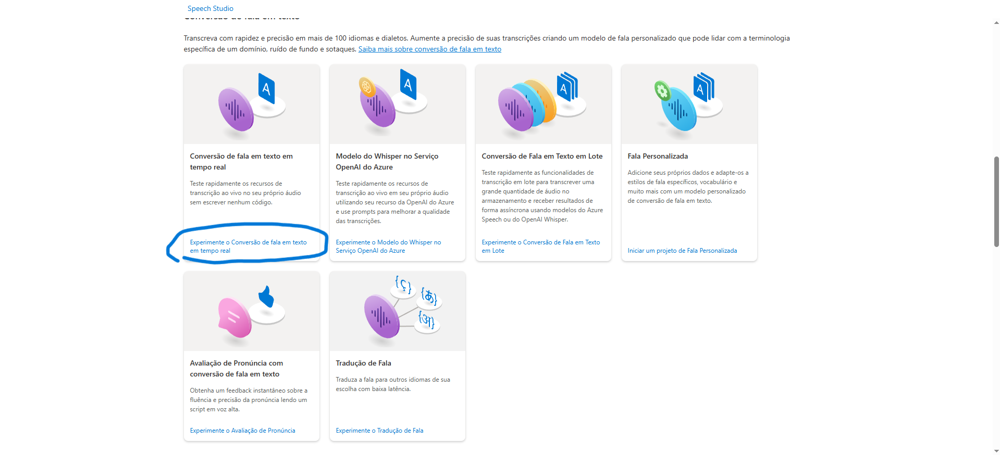

---


## 4️⃣ Gravar Áudio ou Fazer Upload
Escolha entre:
- **Fazer upload** de um arquivo de áudio (.wav, .mp3, etc.).
- **Gravar áudio** diretamente pelo navegador.

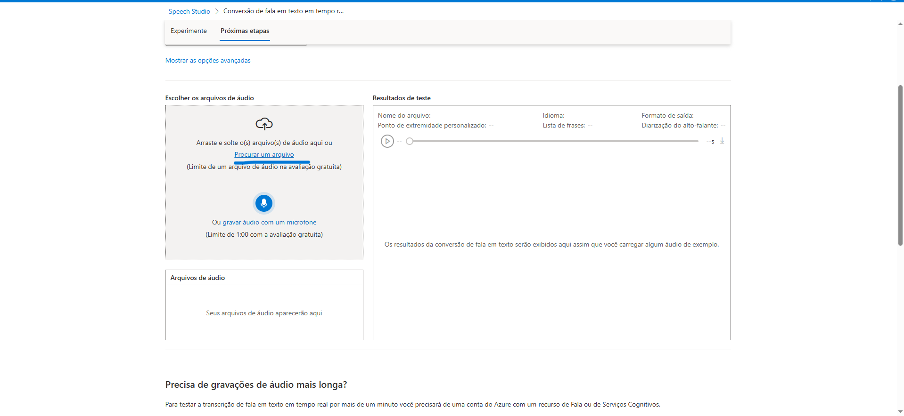

---

### Essa é a forma de json
```markdown
{
        "Id": "de984f11f3ff47faa906d0e0eb4f1057",
        "RecognitionStatus": 0,
        "Offset": 61600000,
        "Duration": 34400000,
        "Channel": 0,
        "DisplayText": "A cant and my here i.",
        "NBest": [
            {
                "Confidence": 0.0917003,
                "Lexical": "a cant and my here i",
                "ITN": "a cant and my here i",
                "MaskedITN": "a cant and my here i",
                "Display": "A cant and my here i.",
                "Words": [
                    {
                        "Word": "a",
                        "Offset": 61600000,
                        "Duration": 4000000
                    },
                    {
                        "Word": "cant",
                        "Offset": 78800000,
                        "Duration": 4400000
                    },
                    {
                        "Word": "and",
                        "Offset": 83200000,
                        "Duration": 1200000
                    },
                    {
                        "Word": "my",
                        "Offset": 84400000,
                        "Duration": 2400000
                    },
                    {
                        "Word": "here",
                        "Offset": 92000000,
                        "Duration": 2400000
                    },
                    {
                        "Word": "i",
                        "Offset": 95600000,
                        "Duration": 400000
                    }
                ]
            }

```
# 💬 Passo a Passo: Como Fazer Análise de Sentimentos no Azure

## 1️⃣ Acesse o Portal do Azure
Abra uma nova guia no seu navegador e vá até o [Portal do Azure](https://portal.azure.com/). Faça login com sua conta Microsoft associada ao Azure.


---
## 2️⃣ Criar um Novo Recurso
1. No menu lateral esquerdo, clique em **"Criar um recurso"**.
2. Na barra de pesquisa, digite **"Language Service"** e selecione a opção correspondente.
3. Clique em **"Criar"** para iniciar a configuração do serviço.

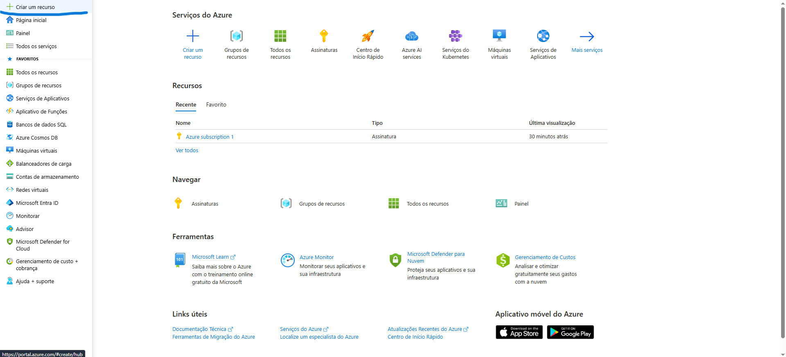
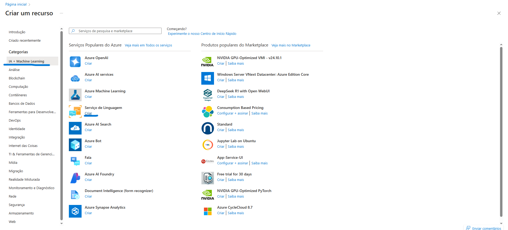
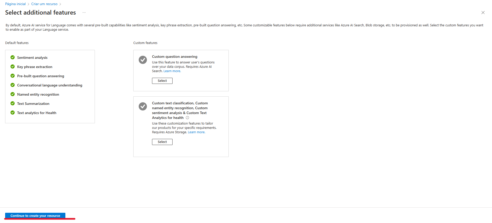
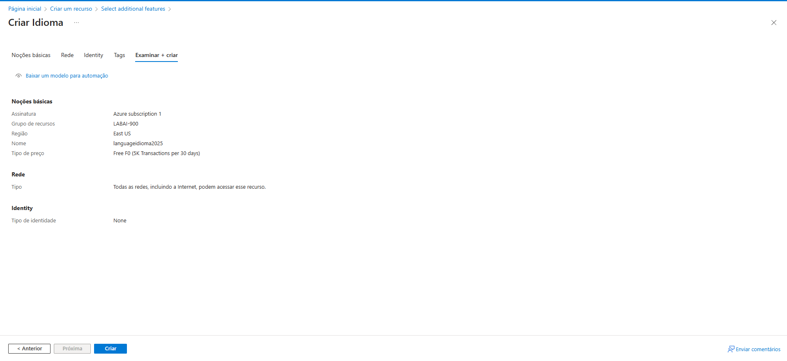
---

## 3️⃣ Acesse o Language Studio
Abra uma nova guia no navegador e vá para o [Language Studio](https://language.azure.com/). Faça login com sua conta do Azure.

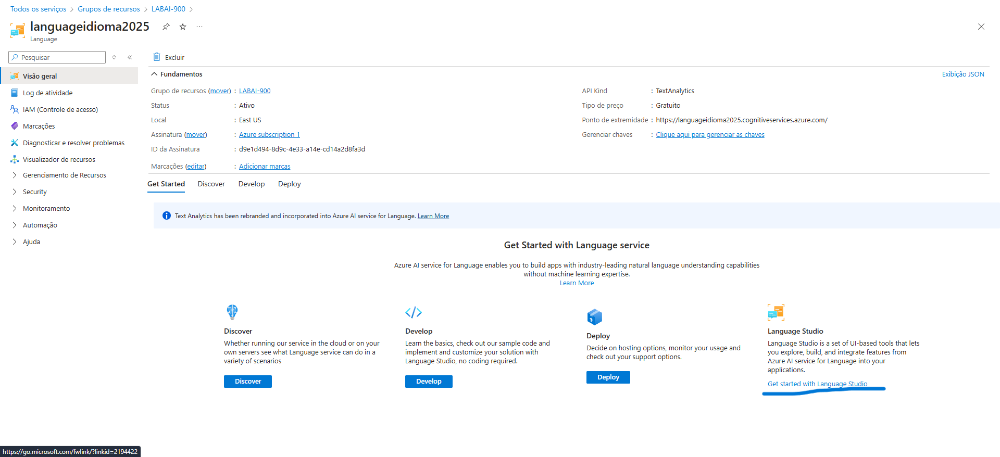

---

## 5️⃣ Selecionar o Recurso do Azure
Ao entrar, aparecerá uma tela pedindo para selecionar um recurso do Azure. Configure da seguinte forma:
- **Diretório do Azure**: Escolha o diretório padrão.
- **Assinatura**: Selecione a assinatura usada na criação do serviço.
- **Tipo de Recurso**: Escolha **Language**.
- **Nome do Recurso**: Selecione o serviço de linguagem criado anteriormente.

Clique em **"Concluir"** para continuar.

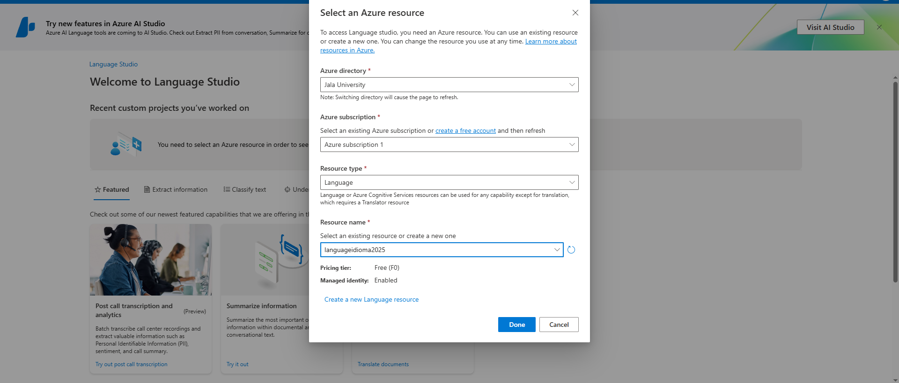

---

## 6️⃣ Executar a Análise de Sentimentos
1. No menu do **Language Studio**, vá até **Classificar Texto**.
2. Selecione **"Analisar Sentimentos e Extrair Opiniões"**.
3. Escolha o idioma do texto (Português ou Inglês).
4. Digite ou cole um texto para análise.
5. Marque a opção de confirmação e clique em **"Executar"**.

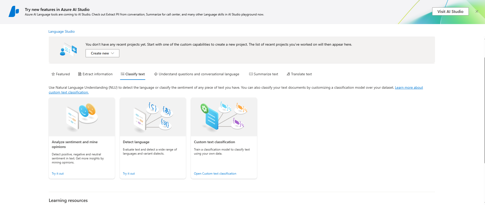
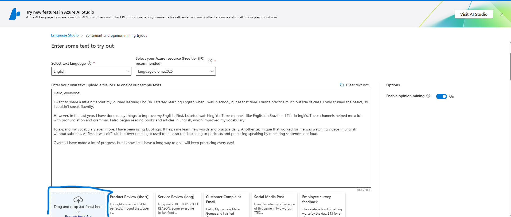

---

## 📊 Resultados da Análise
Após o processamento, os resultados aparecerão na tela. O sistema mostrará o sentimento geral do texto (positivo, neutro ou negativo) e a análise detalhada de cada frase.
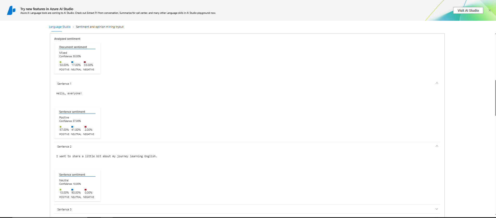
---
